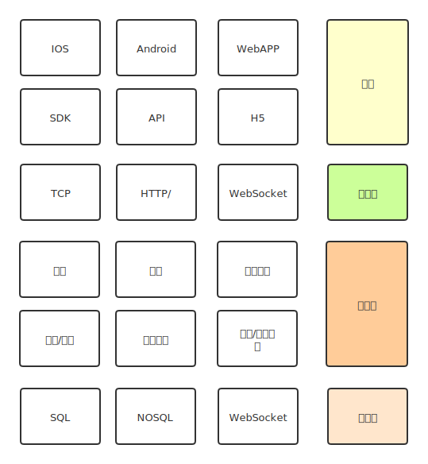

# Gin + WebSocket IM项目

## 需求分析

### 项目目的

项目需求:IM对性能和体验敏感度非常高,熟悉开发流程,

### 项目收获
熟练相关技术栈 gin+GORM+swagger+logrus auth中间件  

### 核心功能

发送和接受消息,文字表情 图片 音频,访客,点对点,群聊,广播,快捷回复,机器人,心跳检测

### 技术栈

前端: js vue    

后端: WebSocket channel/goroutine gin gorm sql nosql MQ

## IM项目系统架构



## IM项目网络架构

```mermaid
graph TD;
    Hybrid App-->应用服务器;
    浏览器-->应用服务器;
    微信环境-->应用服务器;
    应用服务器-->存储;
```

## IM项目消息发送流程


